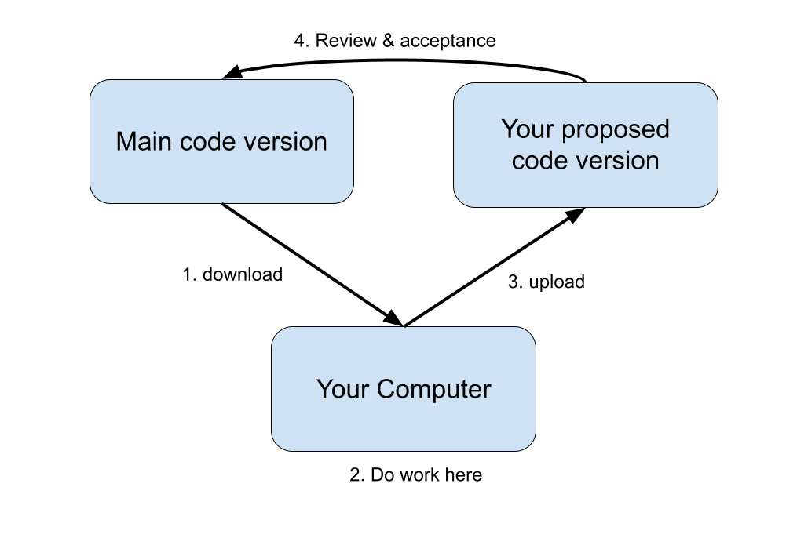

.. _prs:

Pull Requests, Git & GitHub
===========================

When collaborating on a coding project, we generically want a workflow that looks like this:

- The official version of the code should be somewhere anyone can download it from
- You should be able to make and experiment with your own changes on your own machine
- There should be a way for you to then propose that your changes be accepted into the official version, with a mechanism for feedback and corrections beforehand.

Git is the defacto tool for managing the detailed history of a piece of code; GitHub, by extension, adds on some critical features that support the *collaborative process*. In this tutorial, we'll learn how to set up and execute *Pull Requests*, GitHub's name for the collaborative flow pictured above.

To follow this tutorial, you'll need:

 - a free GitHub account
 - git installed in your bash environment 

Our examples will show the workflow with the repository `argovisNg <https://github.com/argovis/argovisNg>`_, but the same applies to all argovis repositories (and most any other repository you find on GitHub).

Setting Up For The First Time
-----------------------------

When you first want to start collaborating on a code repository, there are some one-time setup steps you must perform:

1. *Fork* the repository in question; this is GitHub's jargon for making a copy of the official repository you want to contribute to in your own GitHub account. Visit `https://github.com/argovis/argovisNg <https://github.com/argovis/argovisNg>`_, and click the **Fork** button near the top right corner of the screen. If it asks "Where should we fork?", choose your own GitHub username from the list.

   Once successfully completed, you should have a copy of the repository under your own account on GitHub. Notice near the top left of the resulting page, the repo title is ``<username>/argovisNg``, whereas the original was ``argovis/argovisNg``.

2. *Clone* your fork of the repository to your development machine. To do so, open a bash shell on your machine and do:

   .. code:: bash

      ~ $ git clone <URL of YOUR fork of the repo>

   Notice the URL to substitute is that of your fork of the repo - this is the copy you'll be able to edit directly.

   If successful, a directory named the same as the repo should appear on your machine. Enter it, and check your first *remote*:

   .. code:: bash

      ~ $ cd argovisNg
      argovisNg $ git remote -v

      origin  https://github.com/BillMills/argovisNg (fetch)
      origin  https://github.com/BillMills/argovisNg (push)

   By default, you get one remote named ``origin``. Remotes are shorthand names for remote repositories; you'll see later in this lesson how you can use this shorthand when communicating with GitHub.

3. Set up a second remote that's a shorthand for the main repository we're working with, ``https://github.com/argovis/argovisNg`` in this example:

   .. code:: bash

      argovisNg $ git remote add upstream https://github.com/argovis/argovisNg

   The name ``upstream`` is arbitrary, but it is a common convention since it points at the version of the code that is 'upstream' from our own.

.. admonition:: Disaster Strikes?

   If things ever go truly wrong with the version of the code on your machine, you can always delete the directory you made and start over from the ``git clone`` step above. Note that this will destroy any work you hadn't uploaded to GitHub, but can often be the fastest and easiest way to recover from disaster cases.

Now that we've finished our one-time setup steps, we (at least in principle) never need to do them again; the following diagram summarizes the relationships between everything we've seen so far.

.. image:: ../images/git-flow-1.png

Daily Workflow
--------------

Now that we're all set up, we're ready to begin the daily activity of writing code and proposing it as an update to the main repositories. Qualitatively, the workflow looks like this:

 - Check and see if anyone else added code to the main repository since last time you worked on the project.
 - Make your changes to your local copy of the code.
 - Upload your changes to your copy of the code on GitHub.
 - Ask the main project maintainer to accept your proposed changes to the main repository. 
 - Respond to any corrections or questions the maintainers have.

1. First, we want to keep our local copy of the code up to date with what everyone else has been working on since last we checked; this is where the remotes we set up are going to come in handy. Download any new changes from the main repo to our local machine:

   .. code:: bash

      argovisNg $ git pull upstream main

   The anatomy of this command is:

   - ``git pull``: download some code...
   - ``upstream``: ...from ``upstream``, which recall is shorthand for the URL of the main repo
   - ``main``: ...from the branch named ``main``. If we want to get fancy later we can start making branches other than ``main``, but it's best to just stick to ``main`` the first time you try this.

.. admonition:: Merge Conflict?

   What happens if someone changed some code upstream that contradicts a change you were working on locally? This is called a *merge conflict*, and sooner or later you will get one when you do a ``git pull``. Don't worry about it for now, but when you see one, refer to :ref:`merge_conflict` for a recipe for dealing with this.

2. Now you're all set up to get down to the business of writing code. Go for it!

3. Once you're happy with the code you've written (and I recommend at least once per day), *commit* and *push* your code.:

   .. code:: bash

      argovisNg $ git add <names of any new files you created for this commit>
      argovisNg $ git commit -a -m 'a short description of my awesome code'
      argovisNg $ git push origin main

   The anatomy of these commands are:

   - ``git add <files>``: start tracking some new files in version control. This line can be omitted if you didn't create any new files, and just edited pre-existing files.
   - ``git commit``: save the current state of my code for all time so I can come back to it if I screw up later.

      - ``-a``: include every file in this commit that git was already tracking
      - ``-m 'blah blah'``: a short message to help you remember what this commit was about in future.
   - ``git push``: upload the code...

      - ``origin``: ...to the remote named ``origin`` (remember, that's your copy of the repo on GitHub)
      - ``main``: ...from the ``main`` branch locally to the ``main`` branch on the remote.

4. Once you think you're ready for the maintainers to review your code and consider it for inclusion in the main repo, it's time to set up a *pull request*. In your browser, go back to GitHub and find your copy of the repo you're working on - the URL should be ``https://github.com/<username>/argovisNg``. Once there:

   - Click on **Pull requests**
   - Click the big green button that says **New pull request**.
   - You'll now be on the pull request (PR) setup screen. There are a few things for you to do here:

      - GitHub summarizes the changes this PR will make on this screen. Review them to make sure they are what you intended. Common mistakes are to include too many or too few files in the PR: too few because you forgot to ``git add`` something new, or too many because you ``git add *`` and scooped up things you didn't mean to with the wildcard.
      - [optional]: if you're using branches other than the defaults, on this screen you can choose origin and destination branches. If you're just going ``main`` to ``main``, you don't need to change anything.
      - Once you're happy with the changes, click the big green **Create pull request** button.
      - You'll be taken to a screen with a large text box - write a message to the project maintainers explaining what you changed and why, providing any context or information you think is relevant.
      - Finally, again click on the **Create pull request** button.

   At this point, you've submitted your changes for review to the project maintainers; check back on this page tomorrow and see if they have any comments.

5. It's often the case that project maintainers will provide a review of your work in your PR, asking for corrections or changes. You can do one of two things:

   - Make the changes requested on your local version of the code, commit the changes, and push them to the same branch, exactly as you did above. The new commits will appear in the open pull request as amendments.
   - Reply in the thread on the PR page to answer questions and explain your reasoning.

   Once the maintainers are satisfied, they can *merge* your PR, which means your changes have been accepted to the main version of the code.

   The workflow for making contributions to git repositories we learned here can be summarized with the diagram below, and is how all Argovis projects are maintained. Notice it is exactly the same as the first diagram above that describes generic collaboration; now you know how git and GitHub operations map onto the collaboration workflow.

.. image:: ../images/git-flow-2.png

Best Practices
--------------

So far, we've learned the mechanical commands of proposing changes to projects on GitHub, but there are a few 'soft skills' to keep in mind:

1. **Make small, frequent PRs**: a good pull request should implement exactly one feature - not the dozen things you're currently thinking about all at once. If you're working on more than one thing in parallel, see :ref:`branches` for an introduction to using *branches*. A good rule of thumb is that whenever possible, PRs should be *no more than 500 lines*. The reason for this is speed: huge PRs take a long time to write and a long time to review, so by the time it's ready for merge, the main project might have changed a lot, conflicting with your changes and undermining their original purpose.

2. **Commit and push early and often**: in the above workflow, it looks like you committed, pushed, and set up a PR all as one series of steps. Actually, you can and should commit and push code to your copy of the repositories *very frequently*; you don't need to set up a PR untill you're ready to discuss your changes, and a single PR can have arbitrarily many commits included. Remember that committing and pushing effectively backs up your code: once pushed, GitHub has a copy and keeps it safe.

3. **Pull early and often**: if you're working on a piece of code for a long time (like longer than one day), do the ``git pull`` step every day at least. This way, if someone is making changes to the code that conflict with yours, you can catch it early and solve the problem while its still relatively easy. See :ref:`merge_conflict` for a discussion of handling merge conflicts.

